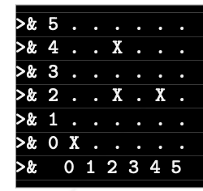

# Subject 번역

> 이 문서에서는 객체지향 프로그래밍의 중요한 파트인 `캡슐화`에 대해 소개합니다.

## Preamble

이 모듈에선, 객체지향 프로그래밍에서 정말 중요한 컨셉을 소개합니다. 5초 동안 잠시 멈춰서, 이 수영장에서 당신에게 제공할 이름들에 대해 정의해보겠습니다.
- _"Object"_ (객체): "물체"를 구체화 하는 개념
- _"Instance of an object"_ (객체의 인스턴스): 주어진 객체에 해당하는 구체적인 엔티티
- _"Attributes"_ (속성/애트리뷰트): 객체의 인스턴스의 내부 변수 
- _"Method"_ (메서드): 객체의 인스턴스와 통신하여 작업을 수행하도록 하는 방법
이제 이 4가지 단어에 동의하게 되었으니 ...
보세요 ... 당신은 그것을 짐작했습니다 !... 바로 "캡슐화"를 말이에요!

이 야만적인 이름 뒤에는 실제로는 다소 단순한 개념이 숨어 있습니다: 어떤 물건에 '속하는' 물건이 있고, 다른 사람이 접근할 수도 있고 그렇지 않을 수도 있다는 것입니다.

객체지향 프로그래밍(OOP)에서 우리는 애트리뷰트와 메서드를 두 가지 방법으로 정의할 수 있습니다.
- **Private**: 이 속성/메서드 들은 엄격하게 객체 내에서만 사용할 수 있습니다.
- **Public**: 이 속성/메서드 들은 클래스의 바깥에서 수정/사용될 수 있습니다.

이 아이디어는 객체를 블랙박스와 비슷하게 만드는 것입니다. 외부에서는 공개된 내용만 접근할 수 있고, 블랙박스에서 일어나는 일은 비공개로 유지됩니다.

> 네, **Protected** 도 있지만, 좀 나중에 이야기 하자구요.

## General rules

- 당신의 프로그램은 어떤 상황에서도 (메모리가 부족한 경우에도) 크래시가 발생하거나 예상치 못하게 종료되어선 안됩니다. 만약 그렇다면, 당신의 프로젝트는 작동하지 않는 것으로 고려되어 0점을 받게 됩니다.
- relink되지 않는 `Makefile`을 통해 소스 파일을 컴파일해야 합니다.
- `Makefile`은 최소 다음의 규칙을 가집니다: `$(NAME)`, `all`, `clean`, `fclean`, `re`
- `c++`와 `-Wall -Wextra -Werror` 플래그로 컴파일해야 합니다.
- 반드시 **`C++98 표준`** 을 지켜야합니다. `-std=c++98` 플래그를 붙여도 정상적으로 컴파일되어야 합니다.
- 항상 가능한 한 많은 C++ 함수를 사용하여 개발하세요(예: `<string.h>` 대신 `<cstring>` 선택). C 함수를 사용할 수 있지만 가능하면 항상 C++ 버전을 선호하세요.
- 어떤 외부 라이브러리와 `Boost` 라이브러리는 금지됩니다.

## Ex 00 : Divide and conquer

> Ex00: 분할정복
>
> `ex00/*.cpp`, `ex00/*.hpp`, `ex00/main.cpp`, `ex01/Makefile` 제출
>
> 표준 STD 컨테이너와 자료구조 허용

이 예제에서는 `DivideAndRule.cpp` 파일에 포함된 코드를 수정해야 합니다. 해당 파일은 다음을 포함합니다:
- 뱅킹 시스템
- 고객 계좌 시스템

고객 계좌 시스템을 갖춘 은행을 나타냅니다.
하지만 이 코드는 42의 Object 피신을 따르지 않은 개발자가 만들었기 때문에 올바르게 캡슐화된 클래스를 만드는 방법을 알 수 없었습니다! 모든 것은 누구나 접근할 수 있습니다!

따라서 누구나 자신의 은행 계좌의 가치를 변경할 수 있습니다! 매우 실용적입니다! 하지만 논리적이지 않습니다 .... 대출도 마찬가지로, 누구나 아무것도 하지 않아도, 심지어 갚을 필요도 없이 대출을 받을 수 있습니다!

이 모든 것이 그다지 깨끗하지 않습니다 ... 그래서....
당신의 임무는 이 코드를 가져와서 두 클래스 `Account`와 `Bank`를 올바르게 캡슐화하여, 비논리적인 어떤 작업도 수행 할 수 없도록하는 것입니다!

최소한 다음 요구 조건을 만족해야 합니다:
- 은행은 이러한 고객 계좌로 유입되는 각 자금의 5%를 받아야 합니다.
- 계정에 두 개의 동일한 ID가 있어서는 안됩니다.
- 구조의 애트리뷰트는 외부에서 수정할 수 없어야 합니다.
- 은행은 이러한 고객의 계정을 생성, 삭제 및 수정할 수 있어야 합니다.
- 은행은 자금 한도 내에서 고객에게 대출을 제공 할 수 있어야 합니다.
- 은행을 통하지 않고 고객 계좌에 돈을 추가하는 것은 불가능 합니다.
- 이해가 된다면, Getter와 Setter 구현은 필수입니다. 복사에 의한 Getter는 허용되지 않습니다. (역: [링크](https://stackoverflow.com/questions/57515089/how-to-use-getters-and-setters-without-generating-a-copy) 참조)
- 이해가 된다면, const Getter의 구현은 필수입니다. 복사에 의한 const Getter는 허용되지 않습니다.
평가하는 동안 이 연습에서 선택한 각 항목에 대해 디펜스해야 합니다.

## Ex 01 : I don't know what I'm doing!

> Ex01: 내가 뭘 하고있는지 모르겠어요!
>
> `ex01/*.cpp`, `ex01/*.hpp`, `ex01/main.cpp`, `ex01/Makefile` 제출
>
> 표준 STD 컨테이너와 자료구조 허용

이 예제에서는 이전 예제에서 배운 것을 적용할 필요가 있습니다.
`float` 타입의 두 개의 컴포넌트 X와 Y를 포함해야 하는 `Vector2`를 생성해야 합니다. `Graph` 클래스를 생성하고 그 위에 새로운 `Vector2`로 표현되는 점을 배치해야 합니다
모든 점이 추가될 때마다 아스키 아트를 통해 화면에 출력해야 합니다.

> 두 애트리뷰트들의 캡슐화에 대해 생각하세요: private? public? 어떤 것으로 두고 싶나요?

`Vector2` 크기와 그래프 위의 각 점을 표현하는 `Vector2`의 목록을 포함하는 `Graph` 클래스를 생성하세요.

> 이 클래스의 캡슐화에 대해 생각해야합니다.
> - 새 점을 추가할때는 어떻게 핸들링해야 하나요?
> - 콘솔에 어떻게 출력할건가요?

(0, 0), (2, 2), (4, 2), (2, 4) 에 대한 예시는 다음과 같습니다:

최소한 다음 요구 사항을 만족해야 합니다:
- 캡슐화에 대해 내린 결정을 설명할 수 있어야 합니다.
- `Vector2`에는 x와 y를 나타내는 애트리뷰트가 포함되어야 합니다.
- 사용자가 `Graph`에 새 `Vector2`를 추가할 수 있어야 합니다.
- 사용자가 `Graph`의 내용을 그래프와 같은 형태로 콘솔에 출력할 수 있어야 합니다.

## Bonuses

보너스로 두 가지 예제에 대한 더 많은 요구 사항을 제안합니다.

### Ex00 : 분할과 지배

- `Account` 클래스에는 const getter를 제외한 다른 메서드는 만들 수 없습니다.
- `Account` 클래스는 `Bank` 클래스의 내부에 존재해야 합니다.
- `Bank` 클래스는 ID로 계정을 가져오기 위한 `[]연산자`가 포함되어야 하지만, 해당 ID에 해당하는 계정을 찾기 위한 `while`이나 `for` 루프를 만들 수 없습니다.
- 오류 관리는 `throw`를 통해 이루어져야 하며, 메인에서 이러한 오류를 처리해야 합니다.

### Ex01 : 무엇을 보고 있나요?

- 모든 점이 표시되는 `Graph` 클래스의 PNG로 그래픽 표현을 생성합니다.
- `Graph` 클래스에 선 기능 추가하기
- `Point` 목록이 포함된 입력 파일 읽기

> (대충 Mandatory가 완벽하지 않으면 보너스 평가 안한다는 내용)